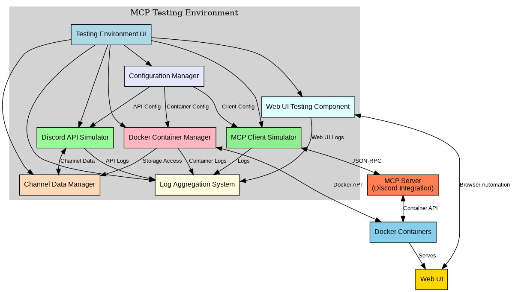

# MCP Testing Environment

A comprehensive testing environment for MCP (Model Context Protocol) servers, with a particular focus on Discord integration. This environment allows AI assistants to independently test and debug MCP servers without requiring complex manual setup.



## Overview

The MCP Testing Environment provides tools for simulating MCP clients, managing Docker containers, aggregating logs from multiple sources, and testing web UIs. It's designed to streamline the development and testing of MCP servers by providing a unified interface for all testing components.

## Testing Philosophy

**IMPORTANT: Human-First, Functional Testing Approach**

This testing environment is designed to prioritize a human-first, functional testing approach:

1. **Start with User Interaction**: Begin testing by simulating how a human would use the MCP server - through natural language prompts and queries
2. **Observe Functional Behavior**: Evaluate the server's responses and behavior from a user's perspective
3. **Identify User-Facing Issues**: Focus first on issues that impact the user experience
4. **Only Then Dive into Code**: After identifying functional issues, use logs and code inspection to diagnose root causes
5. **Implement Fixes**: Make targeted changes to address the identified issues
6. **Verify with Functional Testing**: Confirm fixes by testing again from the user's perspective

Example: When testing a Discord MCP server, start by asking natural questions like "Has anything been said about Manus and Discord recently?" rather than immediately inspecting code or configuration files.

## Features

- **MCP Client Simulator**: Test MCP servers without requiring an actual MCP client like Claude Code
- **Log Aggregation System**: Collect and display logs from multiple sources (MCP servers, Docker containers, web UIs)
- **Docker Container Management**: Start, stop, and monitor Docker containers used for Discord integration
- **Web UI Testing**: Test and debug web interfaces with screenshot capture and network inspection
- **Integration Framework**: Unified web interface for managing all components
- **Sample MCP Server**: A simple MCP server implementation for testing purposes

## Installation

### Prerequisites

- Python 3.8 or higher
- Docker and Docker Compose
- Node.js 14 or higher (for some MCP servers)
- Playwright (for web UI testing)

### Installation Steps

1. Clone this repository:
   ```bash
   git clone https://github.com/yourusername/mcp-testing-environment.git
   cd mcp-testing-environment
   ```

2. Install Python dependencies:
   ```bash
   pip install -r requirements.txt
   ```

3. Install Playwright browsers:
   ```bash
   playwright install
   ```

4. Start the MCP Testing Environment:
   ```bash
   python mcp_testing_environment.py
   ```

5. Access the web interface at http://localhost:8000

## Usage

### Testing an MCP Server

1. Configure the MCP server in the web interface
2. Start all components from the web interface
3. Use the MCP Client Simulator to interact with the MCP server
4. Monitor logs from all components in the Log Aggregation System
5. Test the web UI using the Web UI Testing Component

### Testing a Discord MCP Server

1. Configure the Discord MCP server in the web interface
2. Start the Docker containers for Discord integration
3. Use the MCP Client Simulator to test Discord-specific functionality
4. Monitor logs from all components
5. Test the web UI for Discord integration

## Components

### MCP Client Simulator

Simulates MCP client behavior to test MCP servers without requiring an actual MCP client.

```bash
python mcp_client_simulator.py --transport stdio --interactive
```

### Log Aggregation System

Collects and displays logs from multiple sources in a unified interface.

```bash
python log_aggregator.py --port 8080
```

### Docker Container Management

Simplifies the management of Docker containers used for Discord integration.

```bash
python docker_manager.py --port 8081
```

### Web UI Testing Component

Provides tools for testing and debugging web interfaces.

```bash
python webui_tester.py --port 8082
```

### Integration Framework

Ties all components together into a cohesive testing environment.

```bash
python mcp_testing_environment.py --port 8000
```

## Documentation

- `documentation.md`: Comprehensive documentation for the MCP Testing Environment
- `usage_instructions.md`: Instructions for using the environment in future conversations

## For AI Assistants

This repository is designed to be used by AI assistants in sandbox environments. When a user asks you to test an MCP server:

1. Clone this repository
2. Install the dependencies
3. Start the MCP Testing Environment
4. Connect to the user's MCP server
5. Use the testing tools to verify functionality
6. Provide detailed feedback based on the test results

## Contributing

Contributions are welcome! Please feel free to submit a Pull Request.

## License

This project is licensed under the MIT License - see the LICENSE file for details.
